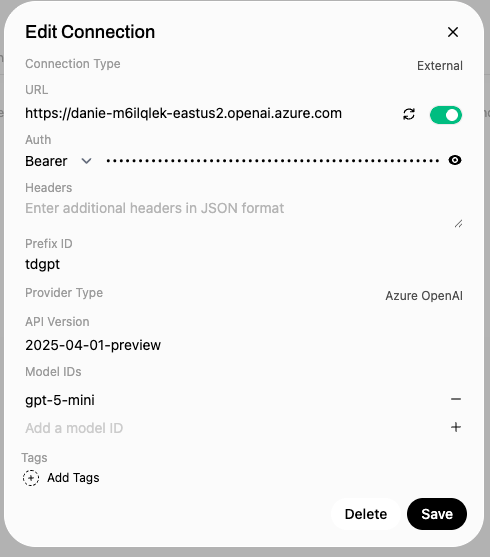
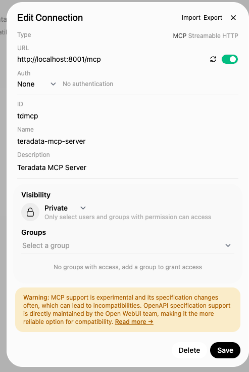

# Using with Open WebUI

> **📍 Navigation:** [Documentation Home](../README.md) | [Server Guide](../README.md#-server-guide) | [Getting started](../server_guide/GETTING_STARTED.md) | [Architecture](../server_guide/ARCHITECTURE.md) | [Installation](../server_guide/INSTALLATION.md) | [Configuration](../server_guide/CONFIGURATION.md) | [Security](../server_guide/SECURITY.md) | [Customization](../server_guide/CUSTOMIZING.md) | [Client Guide](CLIENT_GUIDE.md)

[Open WebUI](https://github.com/open-webui/open-webui) is user-friendly self-hosted AI platform designed to operate entirely offline, supporting various LLM runners like Ollama. It provides a convenient way to interact with LLMs and MCP servers from an intuitive GUI. It can be integrated with this MCP server using the REST endpoints.

Run the MCP server as a [REST server](./Rest_API.md).

```
python -m venv ./env
source ./env/bin/activate
pip install open-webui   
open-webui serve
```

Access the Open Web UI at http://localhost:8080.

To add the LLM Connection, navigate to Settings > admin Settings > Conections > + , and enter your LLM connection details.

- Connection type should be external
- URL should be the end point that servers the LLM
- Bearer should be the end point API key
- Prefix ID can be any unique string
- Provider Type should be the company that serves the model
- API version should be the model version string
- Model Id should be the model name




To add the MCP tools, navigate to Settings > Admin Settings > External Tools > + , and enter your MCP server connection details.

Assuming you ran the MCP server as

```
uv run teradata-mcp-server --mcp_transport streamable-http --mcp_host 127.0.0.1 --mcp_port 8001 --auth_mode none --database_uri "teradata://<username>:<password>@<database host>:1025/<default database>" --profile all
```

- Type should be MCP Streamable HTTP
- URL should be http://localhost:8001/mcp or as defined when running the MCP server
- Auth should be None, unless you started the MCP server with a different auth_mode
- ID can be any unique string
- Name can be any unique string
- Descriontion can be any unique string



Below is an example comfiguration for a 

You should be able to see the tools in the Chat Control Valves section on the right and get your models to use it.


You can now access the OpenAPI docs at: [http://localhost:8002/docs](http://localhost:8002/docs)


For more details on mcpo, see: https://github.com/open-webui/mcpo

