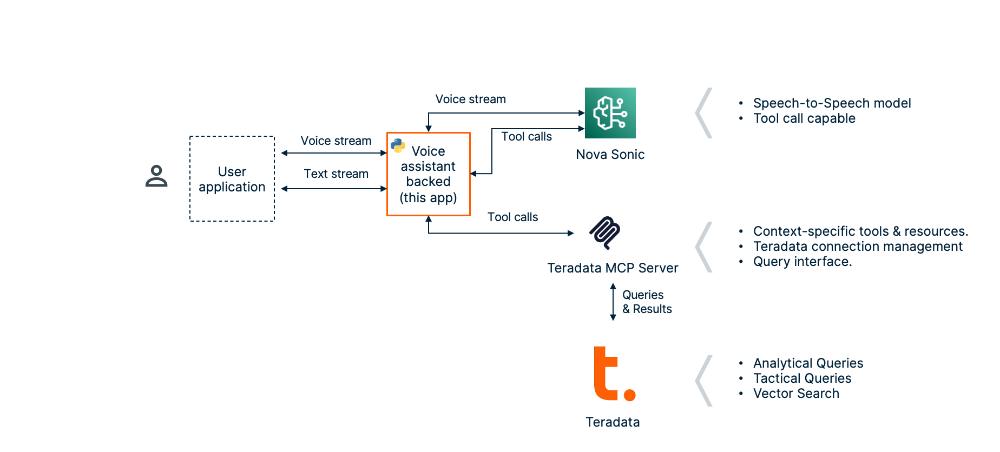

# Voice Assistant with the Teradata MCP server

This tool implements a voice assistant using Amazon Nova Sonic to interact with your Teradata system via the Teradata MCP server. This code is largely inspired from the [Amazon Nova Sonic Python Streaming Implementation](https://github.com/aws-samples/amazon-nova-samples/tree/main/speech-to-speech/sample-codes/console-python) repository.

## Features

- **Realtime bidirectional audio** communication between you system and AWS Bedrock (Nova Sonic models)
- **Tool use** via integration with the Teradata MCP server
- **Multiple language support** with automatic voice selection (English, French, German, Italian, Spanish)
- **Profile management system** with customizable voices, languages, prompts, and MCP and configurations
- **MCP prompt integration** - load prompts directly from MCP server
- **Custom system prompts** - override with command line or profile-based prompts
- Barge-in capability (use headsets ;))
- Simple console-based interface showing transcripts, debug mode

## Prerequisites

- Python 3.12
- AWS Account with Bedrock access
- AWS CLI configured with appropriate credentials
- Working microphone and speakers
- Teradata MCP server and Teradata system.

## Installation

1. Create and activate a virtual environment:

First, navigate to the root folder of the project and create a virtual environment:

```bash
# Create a virtual environment
python -m venv .venv

# Activate the virtual environment
# On macOS/Linux:
source .venv/bin/activate
# On Windows:
# .venv\Scripts\activate
```

2. Install all dependencies:

With the virtual environment activated, install the required packages:

```bash
python -m pip install -r requirements.txt --force-reinstall
```

3. Configure AWS credentials:

The application uses environment variables for AWS authentication. Set these before running the application:

```bash
export AWS_ACCESS_KEY_ID="your-access-key"
export AWS_SECRET_ACCESS_KEY="your-secret-key"
export AWS_DEFAULT_REGION="us-east-1"
```

## Profile Configuration

The voice client now supports profiles for easy configuration management. Create a `profiles.yml` file in the same directory as the script:

```yaml
profiles:
  # Default English profile
  default:
    mcp_server_url: "http://127.0.0.1:8001/mcp"
    system_prompt: |
      You are a friendly assistant. When reading reference numbers, please read each digit individually.
    language: "en"
    voice_id: "matthew"
    
  # Database administrator profile with MCP prompt
  dba:
    mcp_server_url: "http://127.0.0.1:8001/mcp"
    language: "en" 
    voice_id: "amy"
    mcp_prompt: "dba_systemVoice"  # Load prompt from MCP server
    
  # French sales support profile
  sales_fr:
    mcp_server_url: "http://127.0.0.1:8001/mcp"
    system_prompt: "You are a friendly sales analyst."
    language: "fr"
    voice_id: "ambre"
```

### Profile Parameters

- `mcp_server_url`: URL of the MCP server
- `system_prompt`: Custom system prompt text
- `mcp_prompt`: Name of prompt to load from MCP server (overrides `system_prompt`)
- `language`: Language code (`en`, `fr`, `de`, `it`, `es`)
- `voice_id`: Voice ID for speech synthesis (auto-selected if not specified)

## Usage

### 1. Start the Teradata MCP Server

Run the Teradata MCP server with Streamable HTTP (bu default, this demo looks for a MCP server on `localhost:8001`):

```bash
teradata-mcp-server --mcp_transport streamable-http --mcp_port 8001
```

### 2. Run the Voice Client

**Basic usage:**
```bash
python mcp_voice_client.py
```

**Using a profile:**
```bash
python mcp_voice_client.py --profile dba
```

**Using your own settings:**
```bash
python mcp_voice_client.py --language de --voice-id lennart  --system-prompt "You are a technical expert"
```

**With debug mode:**
```bash
python mcp_voice_client.py --debug --profile sales_fr
```

### 3. Additional Commands

**List available profiles:**
```bash
python mcp_voice_client.py --list-profiles
```

**List available MCP tools:**
```bash
python mcp_voice_client.py --list-tools
```

**Test MCP connection:**
```bash  
python mcp_voice_client.py --test-connection --profile dba
```

### How it works



1. When you run the script, it will:
   - Connect to AWS Bedrock
   - Connect to the Teradata MCP server
   - Initialize two streaming sessions towards Bedrock and the Teradata MCP server
   - Start capturing audio from your microphone
   - Stream the audio to the Nova Sonic model
   - Issue tool calls to the MCP server as required over HTTP
   - Play back audio responses through your speakers
   - Display transcripts in the console

2. During the conversation:
   - Your speech will be transcribed and shown as "User: [transcript]"
   - The Nova Sonic's responses will be shown as "Assistant: [response]"
   - Audio responses will be played through your speakers

3. To end the conversation:
   - Press Enter at any time
   - The script will properly close the connection and exit


## Customization

### Command Line Options

```
python mcp_voice_client.py [OPTIONS]

Options:
  --debug                   Enable debug mode with verbose logging
  --profile PROFILE         Profile name to use from profiles.yml
  --language {en,fr,de,it,es}  Interaction language (auto-selects voice)
  --voice-id VOICE_ID       Override auto-selected voice ID
  --mcp-server-url URL      MCP server URL (default: http://127.0.0.1:8001/mcp)
  --system-prompt TEXT      Custom system prompt (overrides profile)
  --mcp-prompt NAME         MCP prompt name to load from server
  --list-profiles           List available profiles and exit
  --list-tools              List available MCP tools and exit
  --test-connection         Test MCP server connection and exit
```

### Voice Selection

If no `voice_id` is specified, voices are automatically selected based on language:
- `en` (English): matthew
- `fr` (French): ambre  
- `de` (German): lennart
- `it` (Italian): beatrice
- `es` (Spanish): carlos

### System Prompt Priority

The system prompt is selected in the following priority order:
1. `--system-prompt` (command line override)
2. `mcp_prompt` loaded from MCP server (if specified)
3. `system_prompt` from profile
4. Default built-in system prompt

### Technical Parameters

You can modify the following parameters in the scripts:

- `SAMPLE_RATE`: Audio sample rate (default: 16000 Hz for input, 24000 Hz for output)
- `CHANNELS`: Number of audio channels (default: 1)
- `CHUNK_SIZE`: Audio buffer size (varies by implementation)

## Troubleshooting

1. **Audio Input Issues**
   - Ensure your microphone is properly connected and selected as the default input device
   - Try increasing the chunk size if you experience audio stuttering
   - If you encounter issues with PyAudio installation:

      **On macOS:**
      ```bash
      brew install portaudio
      ```

      **On Ubuntu/Debian:**

      ```bash
      sudo apt-get install portaudio19-dev
      ```

      **On Windows:** 

      ```bash
      # Install PyAudio binary directly using pip
      pip install pipwin
      pipwin install pyaudio
      ```

      Alternatively, Windows users can download pre-compiled PyAudio wheels from:
      https://www.lfd.uci.edu/~gohlke/pythonlibs/#pyaudio
      ```bash
      # Example for Python 3.12, 64-bit Windows
      pip install PyAudio‑0.2.11‑cp312‑cp312‑win_amd64.whl
      ```

2. **Audio Output Issues**
   - Verify your speakers are working and not muted
   - Check that the audio output device is properly selected

3. **AWS Connection Issues**
   - Verify your AWS credentials are correctly configured as environment variables
   - Ensure you have access to the AWS Bedrock service
   - Check your internet connection

4. **Debug Mode**
   - Run with the `--debug` flag to see detailed logs
   - This can help identify issues with the connection or audio processing


## Known Limitation
> **Warning:** Use a headset for testing, as a known issue with PyAudio affects its handling of echo. You may experience unexpected interruptions if running the samples with open speakers.